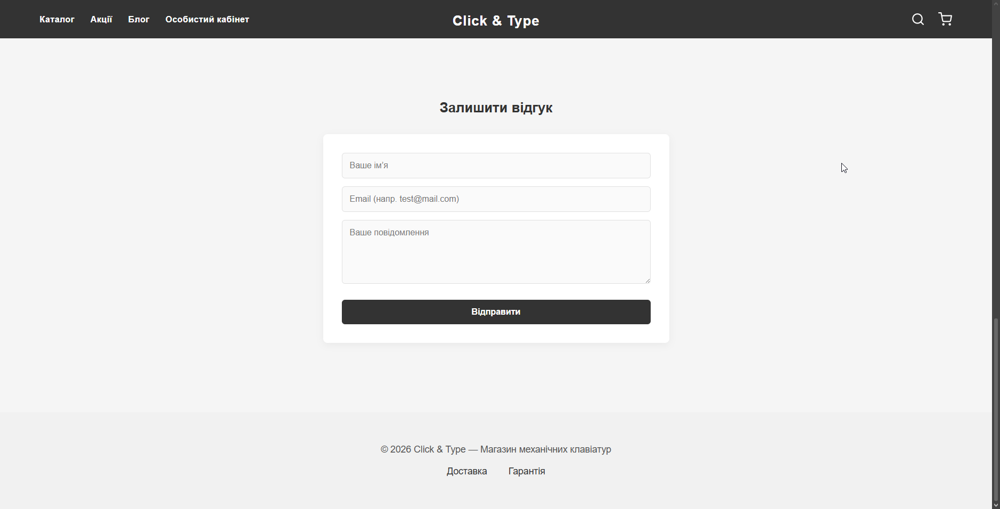
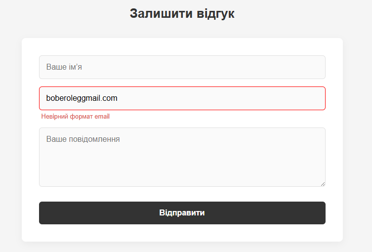
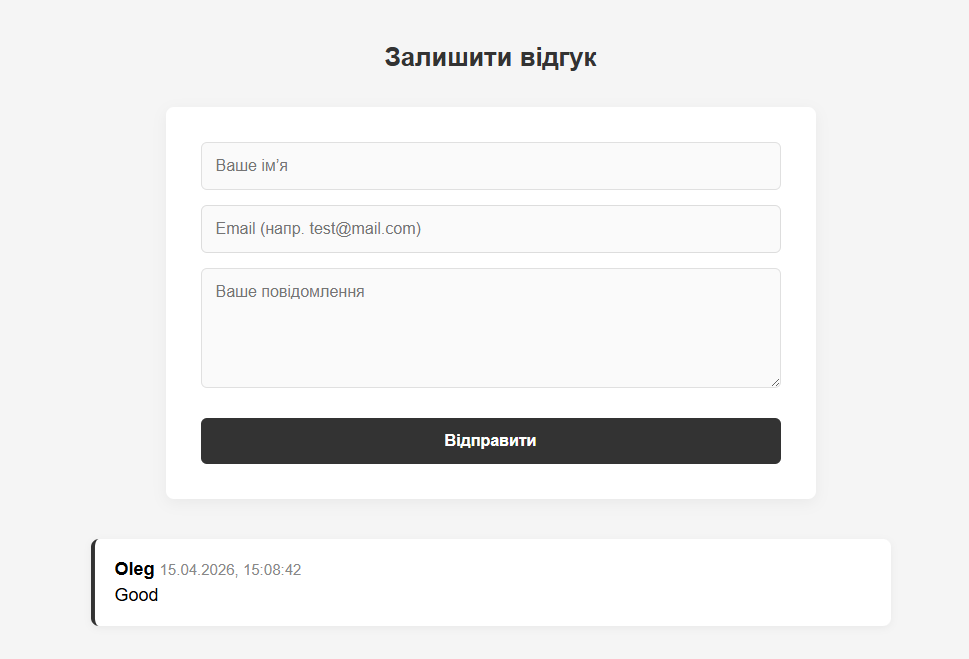
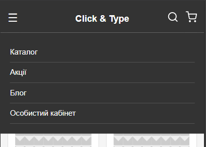

# Практична робота №4: Реалізація інтерактивності Web-інтерфейсу за допомогою JavaScript

## 1. Мета проєкту

Закріплення навичок роботи з JavaScript: маніпуляція деревом DOM, обробка користувацьких подій, впровадження валідації форм та динамічне оновлення контенту сторінки без її перезавантаження.

## 2. Реалізована логіка та інтерактивність

У проєкті реалізовано обробку трьох типів подій, що забезпечують взаємодію користувача з інтерфейсом:

### Подія click

- Мобільне меню: Реалізовано перемикання класу .active для навігаціної панелі при натисканні на іконку "бургер-меню".
- Логотип: Додано обробник кліку на логотип для повернення до початку сторінки.

### Подія input

- Реалізовано перевірку поля Email. При кожному введенні символу спрацьовує регулярний вираз (RegExp): **/^[^\s@]+@[^\s@]+\.[^\s@]+$/**.
- Якщо формат не відповідає шаблону, користувач миттєво бачить повідомлення про помилку та червоне підсвічування поля.

### Подія sumbit

1. Зупинка стандартної поведінки: Використано event.preventDefault(), що забезпечує відсутність перезавантаження сторінки.
2. Комплексна валідація: JavaScript перевіряє всі поля на наявність тексту за допомогою методу .trim(), щоб запобігти відправці порожніх рядків або пробілів.
3. Динамічне оновлення DOM: При успішній валідації скрипт створює новий елемент div через document.createElement, наповнює її даними користувача та поточною датою.
4. Метод prepend(): Новий відгук додається на початок списку, забезпечуючи миттєвий візуальний фідбек.

---

## 3. Скриншоти

**Вигляд форми на ПК**

**Демонстрація помилки Email**

**Вигляд доданої картки відгуку**

**Демонстрація помилки Email**

